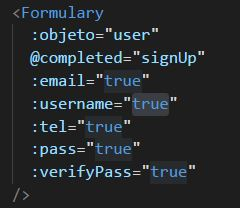

# my-project

> A Vue.js project

## Build Setup

``` bash
# install dependencies
npm install

# serve with hot reload at localhost:8080
npm run dev

# build for production with minification
npm run build

# build for production and view the bundle analyzer report
npm run build --report
```

# Formulary Component 
This is our little project to learn how Vue.js works. In this project we create a component in Vue.js where we give the possibility to the user to create a personalized form.  
To achieve this, we give the options.



## View-Component

